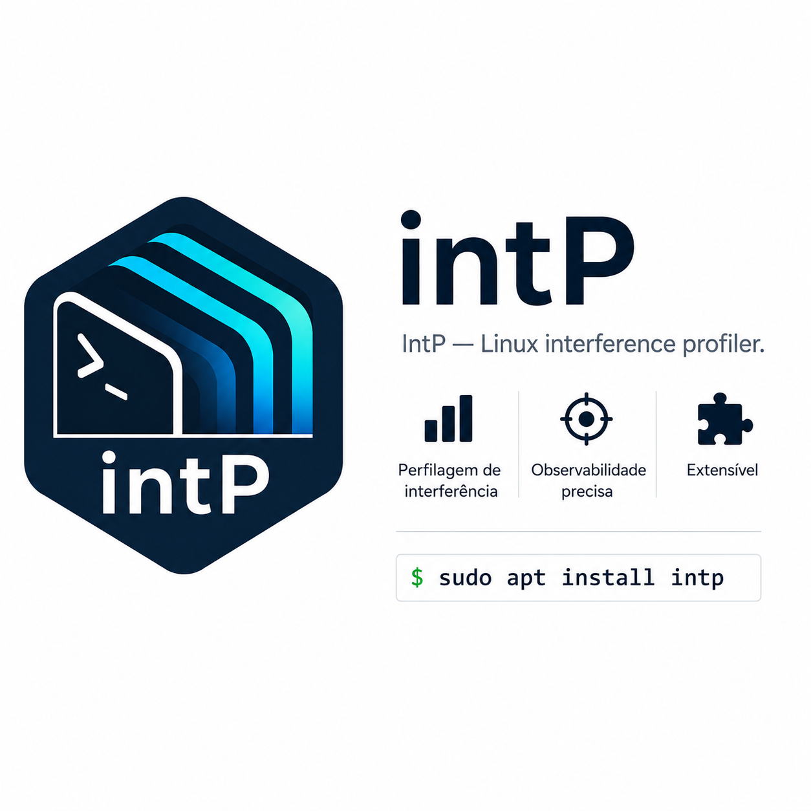

  

# Vision — Why `intp`, and why now

> *"You can't tune what you can't see — and the most expensive forms of
> interference between Linux workloads are exactly the ones nobody is
> looking at."*

This document is the long answer to a short question: **what hole in
the Linux observability stack does `intp` fill, and why is it worth
turning it into an official package?**

---

## The problem in plain words

Two processes on the same Linux box are never truly independent. They
share, at minimum:

- **CPU cycles** — through the scheduler, but also through SMT siblings
  whose pipelines are coupled below the OS line.
- **The last-level cache (LLC)** — a fixed-size resource that the
  hardware partitions on demand, evicting whoever is unlucky.
- **Memory bandwidth** — the LLC↔DRAM channel saturates much sooner
  than the per-core bandwidth would suggest.
- **Block I/O queues** — disks have a finite depth; one bursty writer
  delays everyone behind it.
- **Network stacks and NIC queues** — softirqs, NAPI, RSS hashes; a
  noisy connection drives latency for the polite ones.

Every one of those resources is shared *invisibly* from the point of
view of an application. Each one of them is also a vector of
**performance interference**: the phenomenon where workload A, simply
by existing, makes workload B slower than it would have been alone on
the hardware.

Interference is the silent tax of consolidation. Cloud providers,
Kubernetes operators, and HPC schedulers pay it constantly. They
mostly do not know how much.

## What existing tools show — and what they miss

Linux has no shortage of observability tools. None of them, alone,
answers the interference question:

| Tool                  | What it shows                              | What it misses for interference |
|-----------------------|--------------------------------------------|---------------------------------|
| `top`, `htop`, `atop` | per-process CPU and memory                 | cache, memory bandwidth, I/O queue contention |
| `vmstat`, `sar`       | system-level CPU, memory, I/O              | per-tenant attribution |
| `iostat`              | block device throughput and queue depth    | which process is causing the queue |
| `perf stat`           | hardware counters per process              | LLC occupancy, RDT-class metrics, system view |
| `bpftrace` ad-hoc     | anything you script                        | a stable, named tool packaged across distros |
| `cgroup` accounting   | accounting per cgroup                      | shared-resource interference attribution |

`intp`'s contribution is not "yet another counter reader". It is a
**named, reproducible, packaged** way to collect a curated set of
seven metrics, sampled at a consistent cadence, with consistent
semantics across kernel versions and hardware vendors. So that two
sites running `intp -p <PID>` in 2027 measure the same thing, and a
scheduler can rely on the output without parsing the world.

## The seven metrics, and why these seven

The original *IntP* paper (Xavier & De Rose, SBAC-PAD 2022) settled on
seven metrics after a longer empirical exploration. Each one closes a
specific blind spot:

- **netp** — *NIC-level* network utilization. Catches situations where
  the wire is the bottleneck before the kernel ever notices.
- **nets** — *Stack-level* network utilization. Captures softirq and
  NAPI cost, the part of network handling the application does not pay
  for in its own CPU time.
- **blk** — Block device busy fraction. Disk-side counterpart of `nets`.
- **mbw** — Memory bandwidth via the uncore IMC PMU. The most
  underestimated form of interference: cache-friendly workloads can
  still saturate the memory bus.
- **llcmr** — LLC miss ratio. The probability that a given memory
  reference paid the full DRAM round-trip.
- **llcocc** — LLC occupancy in bytes. *Who is sitting in the cache
  right now*, measured directly via Intel RDT (or the equivalent on
  other vendors as support matures).
- **cpu** — Plain CPU utilization, used as the baseline against which
  the other six are read.

Each metric is independently meaningful. The combination is what makes
it diagnostic: a workload with high `cpu` and low `llcmr` is
CPU-bound; one with moderate `cpu` and high `mbw` is bandwidth-bound;
one with high `llcocc` and high `llcmr` for its neighbours is the
*noisy neighbour* you were looking for.

## Who needs this

Three audiences benefit immediately:

### 1. Cloud / cluster operators

The team that runs a Kubernetes cluster, a research HPC, or a
multi-tenant bare-metal fleet. `intp` lets them answer questions like
*"is pod A degrading pod B?"*, *"is this node oversubscribed in
practice, not just on paper?"*, and *"which workload mixes are safe to
co-locate?"* — without writing custom eBPF.

### 2. Interference-aware schedulers

Tools like
[IADA](https://www.sciencedirect.com/science/article/abs/pii/S0164121222001670)
(also from PUCRS) consume interference signals to decide where to
place work. Today they read `IntP`'s SystemTap output directly. A
packaged, distro-level `intp` lets the next generation of schedulers
target a stable interface rather than research code.

### 3. Performance researchers and engineers

Anyone trying to reproduce a paper, debug a production regression, or
characterise a workload's resource profile. A named tool with an
upstreamed, version-stable output beats a folder of `perf` invocations
every single time.

## Why pursue official packaging at all

A research prototype solves a paper. An installable command solves
problems for everyone else.

- **Discoverability** — `apt search noisy neighbour` should find this.
- **Reproducibility** — *"install `intp` ≥ 1.0 and run it like this"*
  is a citation that survives infrastructure churn.
- **Trust** — distro packaging means somebody (a sponsor, a maintainer,
  a security team) is on the hook for the code, not just an academic
  page that might 404 in five years.
- **Adoption gradient** — a tool you can `apt install` ends up in
  scripts, in dashboards, in Ansible playbooks. A tool you have to
  `git clone && make` does not.

## What this repository is, today

Today, this repository is a **placeholder** — a public reservation of
the `intp` name and a forward-looking statement of intent. The
substance is in
[`intp-comparison`](https://github.com/ggrv-intp/intp-comparison),
which holds seven actively-developed implementation variants, the
benchmarks that compare them, and the technical documents that justify
the design choices.

When the comparison converges and a single variant proves itself
across portability, safety, and fidelity, that variant migrates here,
gets a `debian/` directory, and starts the long road described in
[ROADMAP.md](ROADMAP.md).

Until then: the name is reserved, and the work is happening in the
open next door.

---

  <em>Interference is invisible. <code>intp</code> is the lamp.</em>

